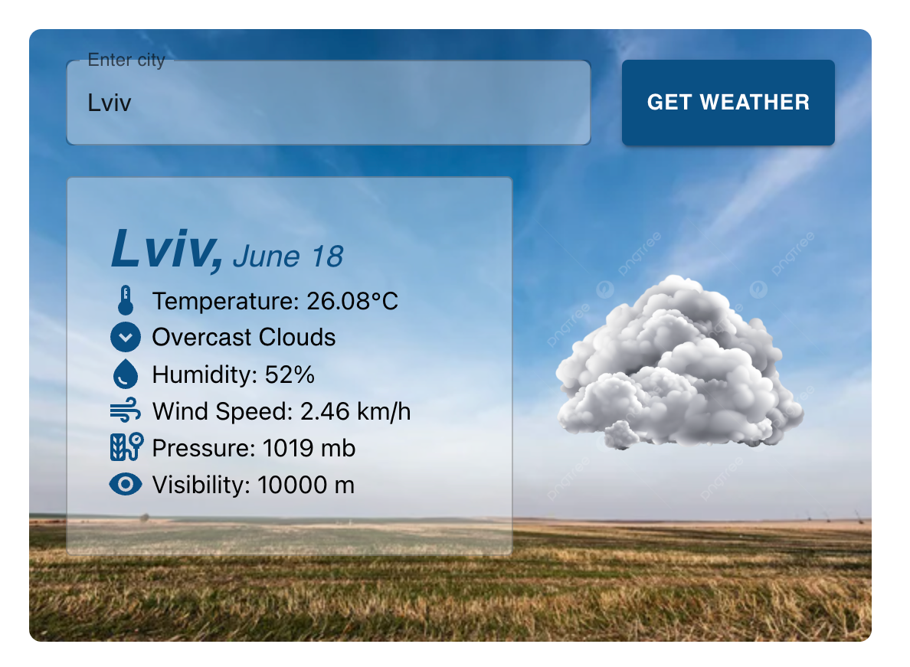

# Weather App

<p align="center">
  
</p>

This project is a web application for searching weather by city and displaying weather results for today's date. It is built using the following technologies:

- Node.js
- Express
- React
- Axios
- TypeScript
- Material-UI
- JavaScript
- OpenWeather API

## Table of Contents

- [Features](#features)
- [Installation](#installation)
  - [Prerequisites](#prerequisites)
  - [Backend](#backend)
  - [Frontend](#frontend)
- [Usage](#usage)

## Features

- Search weather by city
- Display weather results for today's date
- Responsive UI built with Material-UI

## Installation

### Prerequisites

Make sure you have the following installed on your machine:

- Node.js (>=14.x)
- npm (>=6.x) or yarn (>=1.x)

### Steps

1. Clone the repository:

    ```sh
    git clone https://github.com/ChrisHryts/weather-app.git
    cd weather-app
    ```

2. Install backend dependencies:

    ```sh
    cd backend
    npm install
    ```

3. Create a `.env` file in the `backend` directory and add your OpenWeather API key:

    ```sh
    OPENWEATHER_API_KEY=your_api_key_here
    ```

4. Start the backend server:

    ```sh
    npm run dev
    ```

5. Install frontend dependencies:

    ```sh
    cd ../frontend
    npm install
    ```

6. Start the frontend development server:

    ```sh
    npm start
    ```

## Usage

1. Open your web browser and navigate to `http://localhost:3001`.
2. Use the search bar to enter a city name and view the weather results for today's date.
